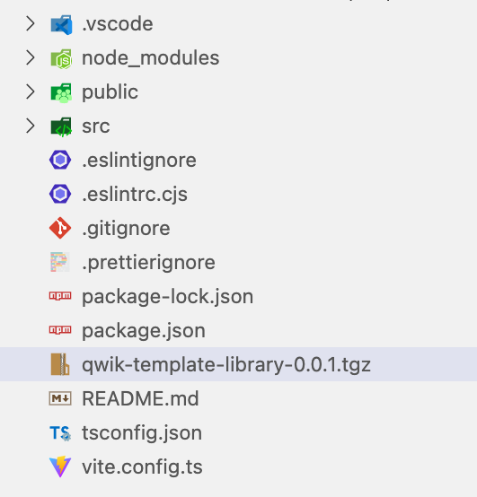
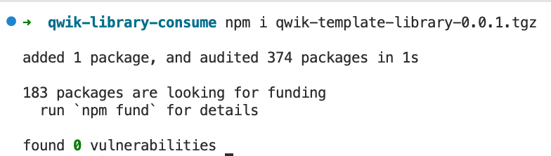

# Qwik Library - Base - by Anartz Mugika Ledo ⚡️

Next I will add all the information we need to know to be able to work with the development of libraries in Qwik.

Here I leave the links of interest about Qwik such as documentation, support,...

- [Qwik Docs](https://qwik.builder.io/)
- [Discord](https://qwik.builder.io/chat)
- [Qwik on GitHub](https://github.com/BuilderIO/qwik)
- [@QwikDev](https://twitter.com/QwikDev)
- [Vite](https://vitejs.dev/)
- [Partytown](https://partytown.builder.io/)
- [Mitosis](https://github.com/BuilderIO/mitosis)
- [Builder.io](https://www.builder.io/)

---

## Project Structure

Within the project in the section where we will develop our library (in `src` directory), we can find these example files to start working with it

Inside your project, you'll see the following directories and files:

```bash

└── src/
    ├── components/
    │   |── counter
        |    └── index.tsx
    │   └── logo
    |        └── index.tsx
    ...
    ├── root.tsx
    └── index.ts
```

- `src/components`: Recommended directory for components. By default, this directory has two basic base components, so that we can improve them and/or build on them to create our own.

- `index.ts`: The entry point of your component library, make sure that all components, classes, interfaces, etc, that will be public are exported from this file.

- `root.tsx`: We can use this file to test the components created while we are developing to facilitate the process and make testing more agile, before packaging it for distribution. To test it we only have to execute the command `npm start` or `npm dev`.


## After developing the library

Once we have already tested our components, hooks and other elements, it is time to think about sending it to production.

Before going directly to upload it to NPM (or Github Packages) it is interesting that we can generate the package locally and consume it by installing it in another project that we are going to create from scratch.

### Create production build

The production build should generate the production build of your component library in (`./dist`) and the typescript type definitions in (`./dist/types`).

```bash
npm run build
```

If we wanted to try simulating in production, we must create the `tgz` file locally

This would be practically the same as trying to install a package from any repository such as NPM, but in this case we will do it with the relative reference of the `tgz` extension file.

### Create our package

To create the compiled package with the `tgz` extension, we must first make sure that the version of our package and its name are correct.

Below is a **list of rules that valid npm package name** should conform to.

- package name length should be greater than zero
- all the characters in the package name must be lowercase i.e., no uppercase or mixed case names are allowed
- package name can consist of hyphens
- package name must not contain any non-url-safe characters (since name ends up being part of a URL)
- package name should not start with . or _
- package name should not contain any spaces
- package name should not contain any of the following characters: `~)('!*`
- package name cannot be the same as a node.js/io.js core module nor a reserved/blacklisted name. For example, the following names are invalid: `http`, `stream`, `node_modules`, `favicon.ico`
- package name **length cannot exceed 214**

To **manage versions**, we work with the [semantic versioning convention](https://semver.org/).

Given a version number `MAJOR`.`MINOR`.`PATCH`, increment the:

- `MAJOR` version when you make incompatible API changes
`MINOR` version when you add functionality in a backward compatible manner
- `PATCH` version when you make backward compatible bug fixes
Additional labels for pre-release and build metadata are available as extensions to the `MAJOR`.`MINOR`.`PATCH` format.

This will be managed, for each new version we will add the corresponding value depending on what has been done, if they have been minor or more relevant changes.

Remember, it always has to be GREATER than the previous version.

For example:

- From 1.0.0 to 1.0.1 (Valid)
- From 1.0.1 to 1.0.0 (Invalid)

If we want to consume the created library, we need to generate the `*.tgz` file, which will be generated with the result `<package-name>.<package-version>.tgz` (Package name and version defined in `package.json` file).

If our package has this data in the package.json:

name: `qwik-library`
version: `1.0.0`

Running `npm run pack` generates a file called `qwik-library-1.0.0.tgz`


### How to consume the generated library for testing locally

First, we must create a project in Qwik using the following command:

```bash
npm create qwik@latest
```

We have the new project created to test it and once the tgz package is generated, we need to take this file, add it to the root of this project and execute it using the relative path of the `*.tgz` library to consume it in the new application.



Run this command:

```bash
npm i <PATH tgz package> 

# if we have brought the file to the root directory of our new project
npm i ./qwik-library-1.0.0.tgz
```

If the whole process has gone correctly, it should appear like this:



**Pending to finish**
